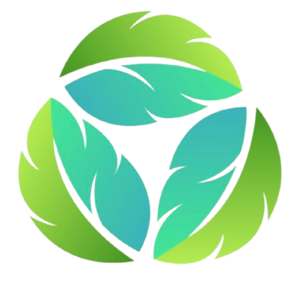

 

  

<h3 align="center">Quiz App</h3>

  

    Quiz App su economia circolare e riciclo.
     
    <a href="https://github.com/rocconmarco/quiz-app"><strong>Repository GitHub »</strong></a>
     
  

## About The Project

Quiz App è un progetto di educazione alla sostenibilità creato in
collaborazione con start2impact University nell'ambito del corso
"Typescript e React".

 

L'obiettivo del progetto era quello di creare un'app tramite la quale
l'utente potesse imparare diversi concetti sull'economia circolare e sul
riciclo. Il Quiz ha proprio questo scopo, e per stimolare l'utente a
fare sempre meglio sono stati creati vari livelli di risultato in base
alle risposte corrette.

 

Per qualsiasi approfondimento o proposta di collaborazione potete
contattarmi tramite i canali qui sotto.

 

## Contact

<b>Marco Roccon - Digital Innovation & Development</b> 
Portfolio website: https://rocconmarco.github.io/ 
Linkedin: https://www.linkedin.com/in/marcoroccon/ 
GitHub: https://github.com/rocconmarco

Project Link: https://thenewyorkclone.netlify.app

 

## Copyright

© 2024 Marco Roccon. Tutti i diritti riservati.
